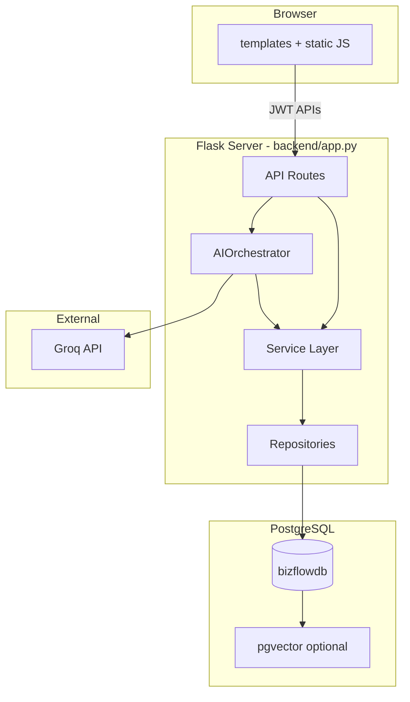

# Architecture

## High-level system diagram

## Request flow: AI chat

1. **User** sends a message from `/chat` via `fetchWithAuth('/api/chat')`.
2. **`ChatService`** delegates to **`AIOrchestrator`**.
3. **`ContextBuilder`** loads business state and RAG retrieval snippets from PostgreSQL.
4. **`GroqProvider`** sends the system prompt + user message to Groq.
5. **`ActionValidator`** validates structured JSON actions.
6. High-impact actions may be queued in **`pending_actions`** for manager approval.
7. Valid actions execute through **`ActionExecutor`** → services → repositories → database.
8. Response `{ reply, actions, state }` returns to the browser.

The **Groq API key never leaves the server**.

## Backend layout

| Layer | Path | Role |
|-------|------|------|
| Routes | `backend/routes/` | HTTP endpoints, auth decorators |
| Services | `backend/services/` | Business logic |
| Repositories | `backend/storage/repositories/` | Data access |
| Models | `backend/storage/models.py` | SQLAlchemy ORM |
| AI | `backend/ai/` | Orchestration, prompts, validation |
| Embeddings | `backend/embeddings/` | RAG indexing and retrieval |
| Auth | `backend/auth/` | JWT, roles, permissions |

## Frontend layout

| Path | Role |
|------|------|
| `templates/` | Multi-page UI (login, dashboard, chat, inventory, orders, customers, reports, approvals) |
| `static/auth.js` | JWT token storage and `fetchWithAuth` |
| `static/nav.js` | Role-based navigation |
| `static/*.js` | Page-specific logic |

## Database

- **PostgreSQL** via `DATABASE_URL` in `.env`
- **Alembic** migrations in `backend/migrations/`
- **pgvector** used when the extension is installed; otherwise embeddings fall back to JSON columns
- Verify/repair: `python -m backend.scripts.verify_db --fix`

## Authentication

- JWT access tokens (Bearer header or cookie)
- Roles: `staff`, `manager`, `admin`
- First registered user becomes `admin`; public registration defaults to `staff`
