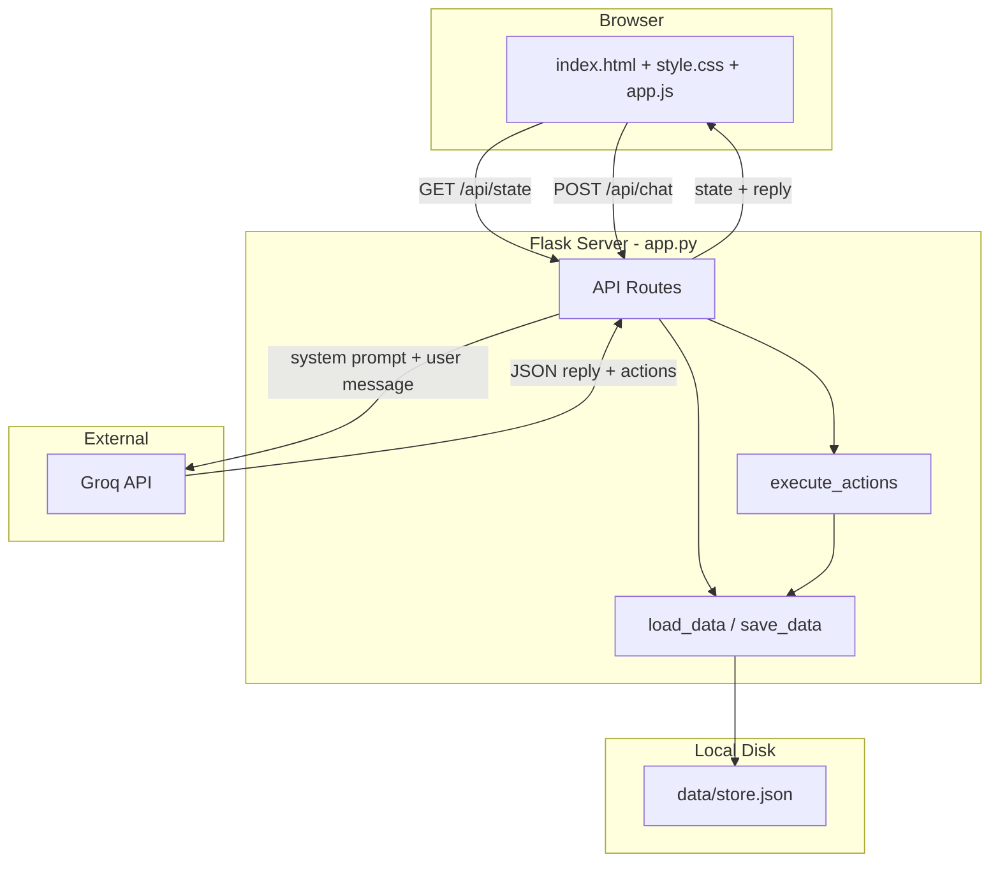

# Architecture

## High-level system diagram



## Request flow: AI chat

This is the most important path in the application.

1. **User** types a message in `#chatInput` and sends it (button or Enter).
2. **`app.js`** appends a user bubble, shows typing indicator, `POST /api/chat` with `{ "message": "..." }`.
3. **`app.py`** loads `data/store.json` and builds a **system prompt** containing current inventory, last 10 orders, and customers.
4. **Groq** receives system + user messages; returns text that should be pure JSON: `{ "reply": "...", "actions": [...] }`.
5. **`parse_groq_json()`** strips markdown code fences if present and parses JSON.
6. **`execute_actions()`** runs each action (add product, create order, etc.) against in-memory data.
7. **`save_data()`** writes updated JSON to disk.
8. **Response** `{ reply, actions, state }` returns to the browser.
9. **`app.js`** calls `executeState(state)`, updates badges and dashboard, shows AI message and optional invoice/inventory cards.

The **Groq API key never leaves the server**. The browser only talks to Flask on `localhost:5000`.

## Layer responsibilities

### Frontend (`templates/index.html`, `static/`)

| File | Role |
|------|------|
| `index.html` | Layout: header, sidebar, five panels |
| `style.css` | Dark theme, grid layout, components |
| `app.js` | State hydration, panel switching, chat, renders |

Frontend holds a copy of business data in a `state` object. It is refreshed after every successful chat response (and on initial page load via `/api/state`).

### Backend (`app.py`)

| Area | Role |
|------|------|
| Routes | HTTP entry points |
| `load_data` / `save_data` | JSON persistence |
| `build_system_prompt` | Injects live business data into AI instructions |
| `parse_groq_json` | Robust parsing when model wraps JSON in markdown |
| `execute_actions` | Deterministic business logic — source of truth |

### Storage (`data/store.json`)

Single JSON document with keys: `inventory`, `orders`, `customers`, `activity`, `order_counter`. Created automatically on first run if missing.

## UI layout (CSS Grid)

```
+------------------------------------------+
|  HEADER (logo + model badge + status)    |
+------------+-----------------------------+
|  SIDEBAR   |  MAIN (one active panel)    |
|  220px     |                             |
|  Dashboard |                             |
|  AI Chat   |                             |
|  Inventory |                             |
|  Orders    |                             |
|  Customers |                             |
+------------+-----------------------------+
```

Only one `.panel` has class `active` at a time. `showPanel(name)` in JavaScript toggles visibility and triggers the relevant render function.

## AI action execution model

The LLM is a **planner**, not an executor:

- It outputs a list of **typed actions** (e.g. `create_order`).
- Python code in `execute_actions()` implements rules: price lookup, stock deduction, customer upsert, activity logging.
- Action type `info` means “reply only” — no data mutation.

This design prevents the model from inventing arbitrary database changes and keeps invoices mathematically consistent (subtotals = price × qty from inventory).

## Security model (MVP)

| Concern | Handling |
|---------|----------|
| API key | Stored in `.env`, used only in `app.py` |
| Input | Chat message stripped; empty → HTTP 400 |
| File I/O | try/except on read/write; `data/` auto-created |
| Groq errors | Returned as JSON `{ error, details }` to frontend |

There is no authentication. The app is intended for **local development** on a single machine.

## Error handling

| Failure | Behavior |
|---------|----------|
| Missing/placeholder API key | HTTP 500, message in chat |
| Groq network error | HTTP 502 |
| Groq non-200 | Pass through status + response text |
| Unparseable AI JSON | Friendly fallback reply, empty actions, unchanged state saved only if actions ran (none in that case) |
| Corrupt `store.json` | Reset to default empty structure |

## Planned architecture changes (TODOs in code)

- SQLite instead of JSON for scale
- Flask-Login for multi-user
- PDF generation (reportlab)
- Order date filtering API
- CSV export

See comments at the end of `app.py`.
